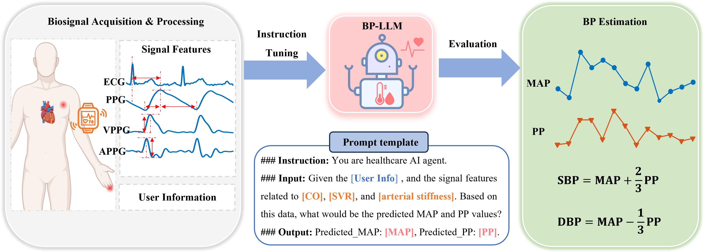

# Large Language Models for Cuffless Blood Pressure Measurement From Wearable Biosignals

## Abstract
Large language models (LLMs) have captured significant interest from both academia and industry due to their impressive performance across various textual tasks. However, the potential of LLMs to analyze physiological time-series data remains an emerging research
field. Particularly, there is a notable gap in the utilization of LLMs for analyzing wearable biosignals to achieve cuffless blood pressure (BP) measurement, which is critical for the management of cardiovascular diseases. This paper presents the first work to explore the capacity of LLMs to perform cuffless BP estimation based on wearable biosignals. We extracted physiological features from electrocardiogram (ECG) and photoplethysmogram (PPG) signals and designed context-enhanced prompts by combining these features with BP domain knowledge and user information. Subsequently, we adapted LLMs to BP estimation tasks through instruction tuning. To evaluate the proposed approach, we conducted assessments of ten advanced LLMs using a comprehensive public dataset of wearable biosignals from 1,272 participants. The experimental results demonstrate that the optimally fine-tuned LLM significantly surpasses conventional task-specific baselines, achieving an estimation error of 0.00 ± 9.25 mmHg for systolic BP and 1.29 ± 6.37 mmHg for diastolic BP. Notably, the ablation studies highlight the benefits of our context enhancement strategy, leading to an 8.9% reduction in mean absolute error for systolic BP estimation. This paper pioneers the exploration of LLMs for cuffless BP measurement, providing a potential solution to enhance the accuracy of cuffless BP measurement.

  

